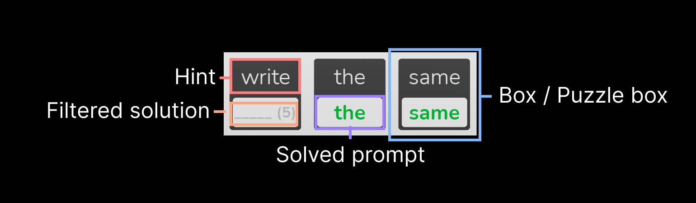

# Hint-Driven Word Puzzle System
> A modular word puzzle system inspired by the mechanics of Linglox.
---

## Features

**Puzzle Mechanics**
- Puzzle boxes with editable prompts
- Hint-based word solutions
- Door progression system that unlocks new areas
- Box completion animations

**Technical**
- Modular architecture for easy expansion
- Client-side GUI with server-side validation
- Secure solution checking to prevent exploits

---

## Showcase
[](https://www.youtube.com/watch?v=9HX1YfS0khI)

---

## Architecture

```
Workspace
 └─ Map
     ├─ Doors
     │   └─ (List of doors, named by the room to open)
     └─ Rooms
         └─ (Room Name)
             ├─ Boxes
             │   └─ (Puzzle box parts)                         │ Each part must be tagged "PuzzleBox" and have the attribute "Hint" to function properly.
             └─ (Other things, like Geometry or Props)


ReplicatedStorage
 ├─ Modules
 │   ├─ Animations                                             │ Handles the animation played when a box is solved.
 │   ├─ BoxInitialization                                      │ Initializes all GUI for boxes and connects input listeners.
 │   ├─ ColorDisplay                                           │ Displays the color of the part the player is looking at.
 │   └─ PuzzleBoxHandler                                       │ Displays door progress locally and sets handles everything needed whenever a box is solved.
 ├─ Events
 │   ├─ Bindables
 │   │   ├─ UpdateCompletedRoom
 │   │   └─ BoxCompleted
 │   └─ Remotes
 │       ├─ SendSolvedList
 │       ├─ UpdateAllBoxes
 │       ├─ UpdateSolvedBox
 │       └─ UpdateDoorProgress
 ├─ Functions
 │   ├─ Bindables
 │   │   ├─ GetSolvedBoxes
 │   │   ├─ IsBoxSolvable
 │   │   ├─ UnlockRooms
 │   │   └─ UpdateSolvedRoom
 │   └─ Remotes
 │       ├─ CheckSolution
 │       └─ GetSolutionLength
 ├─ EventRegistry                                              │ Centralized access for events / functions, allowing cleaner code and easier access.
 ├─ BoxTemplateGui                                             │ Template to be cloned on the corresponding part
 ├─ DoorTemplateGui
 └─ HintTemplateGui


 StarterGui
 └─ ColorDisplay
     └─ TextLabel
         └─ UIStroke


ServerScriptService
 ├─ Modules
 │   ├─ PlayerData                                             │ Handles anything data related, like saving/loading, updating completed rooms and solved box data.
 │   ├─ Rooms                                                  │ Server-sidedly handles door progress.
 │   └─ Solutions                                              │ Used for filtering messages and checking if solutions are correct.
 └─ Main.Server.Lua                                            │ Main server script that initializes anything server-related.


 ServerStorage
 └─ SolutionList                                               │ Contains all room data and box solutions.


StarterPlayerScripts
 └─ Main.Client.Lua                                            │ Main client script that initializes anything client-related.
```

#### Reference


#### System flow

- `Main.Server.lua` initializes all modules, events, and player data when the game starts.
- When a player joins, their saved progression is loaded and the server sends the solved box list using `SendSolvedList` so the client can reconstruct the correct puzzle states.

- `Main.Client.lua` initializes all puzzle boxes using the `BoxInitialization` module.
- During initialization, every part tagged `PuzzleBox` is validated and gets its corresponding GUI elements cloned onto it. The solution of the box is masked server-sidedly (for example "good" to "____") and set as a placeholder text, while also applying its hint text. The module also connects the input listener to listen for text changes.

- When a player types something into a puzzle box, the client makes sure that the input length never exceeds the expected solution length by truncating extra characters.

- Once the input reaches the correct length, the client asks the server for validation using the `CheckSolution` RemoteFunction.

- The server verifies that the puzzle box is currently solveable using `IsBoxSolvable`, preventing players from solving puzzles inside of locked rooms. If valid, the correct solution is retrieved from the `SolutionList` and compared with the player's input.

- If the solution is correct, the server updates the solved state for that box and fires the `BoxCompleted` event.

- The client then triggers the local `OnBoxSolved` function, which releases textbox focus, updates the visual state, and plays the completion animation.

- After a box is solved, the server checks how many puzzle boxes remain unsolved in the current room.

- If some boxes still remain, the server sends `UpdateDoorProgress` so that the client can update the door progress display.

- If all boxes in the room are solved, the server unlocks the door and fires `UpdateCompletedRoom`, which stores the completed room in the player's data.

- If the player clears the input field. the box resets to its default visual state and the solved status is removed.

---

## Code snippets

Check out [code-snippets.lua](code-snippets.lua) for code examples.

---

## Why I Made This

At the time, I was heavily playing Linglox and became interested in how its puzzle mechanics worked.
I decided to recreate a similar system as a programming challenge and to experiment with designing modular puzzle mechanics.

## What I Learned

I learned how to design initialization systems for large number of interactable objects, like the boxes and doors.

I also learned how to manage complex communication between the client and the server, since this project uses a lot of events and functions. This also helped me learn how to structure systems using modules and event registries.

Lastly, I learned how I can handle player progression data safely and efficiently.

## What I'd Improve

If I continued developing this project, I would add stronger audio/visual feedback by adding sound and improve animations. I would also expand the map and puzzles, and also introduce additional mechanics to make my project stand out and...

Door animations, sound feedback, expand on the map, add new mechanics and so forth, but that would turn it from a small system to a whole game D: (no motivation)

---

> ✅ **Status:** Completed (as a prototype system)
